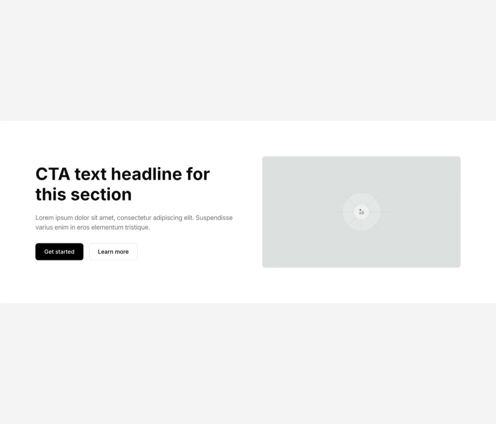

# CTA 1 — Call to Action with Image

## Description

A two-column CTA section with content on the left and an image on the right. The content side includes a heading group (H2 + description) and a button group (primary + secondary). On tablet, it collapses to a single column. Clean, minimal design suitable for conversion-focused sections.

## Visual Reference



## Element Tree

```
Section (cta-1)
└── Container (Inner) — CSS Grid 2-col
    ├── Block (Content)
    │   ├── Block (Heading Group)
    │   │   ├── Heading (h2) — "CTA text headline for this section"
    │   │   └── Text-Basic (Description) — body copy
    │   └── Block (Button Group) — flex row
    │       ├── Button (Primary) — "Get started"
    │       └── Button (Secondary) — "Learn more"
    └── Block (Media Wrapper)
        └── Image — 16:9 aspect ratio, cover fit
```

## Global Classes Used

| Class Name | Element | Key Styles |
|---|---|---|
| `cta-1` | Section | _(empty — inherits from section defaults)_ |
| `cta-1__inner` | Container | CSS Grid, `var(--grid-2)`, gap `var(--space-l) var(--space-2xl)`, collapses to `var(--grid-1)` on tablet, max-width `var(--container-max-width)` |
| `cta-1__content` | Content Block | row-gap `var(--space-m)`, mobile row-gap `var(--space-m-mobile)` |
| `cta-1__heading-group` | Heading Group | row-gap `var(--space-s)`, mobile row-gap `var(--space-s-mobile)` |
| `cta-1__heading` | Heading | _(empty — inherits)_ |
| `cta-1__description` | Description | font-size `var(--text-l)`, color `var(--text)` |
| `cta-1__media-wrapper` | Media Wrapper | _(empty — inherits)_ |
| `cta-1__image` | Image | aspect-ratio `16/9`, object-fit `cover`, border-radius `var(--radius-s)` |
| `button-group` | Button Group | flex row, wrap, gap `var(--space-xs)`, width `var(--w-fit)` |
| `btn-primary` | Primary Button | font-size `var(--text-m)`, weight 500, padding inline/block via vars, bg `var(--btn-primary-bg)`, hover bg `var(--btn-primary-hover-bg)`, radius `var(--radius-s)`, transition `var(--btn-transition)` |
| `btn-secondary` | Secondary Button | font-size `var(--text-m)`, weight 500, border solid `var(--border-width)` `var(--border-color)`, bg `var(--btn-secondary-bg)`, hover states for bg/border/text, radius `var(--radius-s)`, transition `var(--btn-transition)`, flex-shrink 0 |

## Design Tokens (CSS Variables) Referenced

**Layout**: `--grid-2`, `--grid-1`, `--container-max-width`, `--container-width`, `--w-fit`
**Spacing**: `--space-xs`, `--space-s`, `--space-m`, `--space-l`, `--space-2xl`, `--space-s-mobile`, `--space-m-mobile`
**Typography**: `--text-m`, `--text-l`, `--leading-relaxed`
**Colors**: `--text`, `--border-color`, `--btn-primary-text`, `--btn-primary-bg`, `--btn-primary-hover-bg`, `--btn-secondary-text`, `--btn-secondary-bg`, `--btn-secondary-hover-bg`, `--btn-secondary-hover-border`, `--btn-secondary-hover-text`
**Border**: `--border-width`, `--radius-s`
**Transition**: `--btn-transition`
**Button sizing**: `--btn-medium-padding-inline`, `--btn-medium-padding-block`

## Bricks Builder Code

```json
{"content":[{"id":"mcepsy","name":"section","parent":0,"children":["yjjmyc"],"settings":{"_cssGlobalClasses":["te79vv","shvjdm"]},"label":"CTA 1"},{"id":"yjjmyc","name":"container","parent":"mcepsy","children":["ccqlcu","jbcxvi"],"settings":{"_direction":"row","_cssGlobalClasses":["z69npg"]},"label":"Inner"},{"id":"ccqlcu","name":"block","parent":"yjjmyc","children":["migxvf","debcwd"],"settings":{"_cssGlobalClasses":["yrcgjg"]},"label":"Content"},{"id":"debcwd","name":"block","parent":"ccqlcu","children":["hkgnye","ctvegh"],"settings":{"_cssGlobalClasses":["fogixp"]},"label":"Button Group"},{"id":"hkgnye","name":"button","parent":"debcwd","children":[],"settings":{"text":"Get started","_cssGlobalClasses":["ekzwnh"],"link":{"type":"external","url":"#"}},"label":"Button Primary"},{"id":"ctvegh","name":"button","parent":"debcwd","children":[],"settings":{"text":" Learn more","_cssGlobalClasses":["vrmhay"],"link":{"type":"external","url":"#"}},"label":"Button Secondary"},{"id":"kctqrq","name":"heading","parent":"migxvf","children":[],"settings":{"text":"CTA text headline for this section","_cssGlobalClasses":["zmebyi"],"tag":"h2"},"label":"Heading"},{"id":"psyete","name":"text-basic","parent":"migxvf","children":[],"settings":{"text":"Lorem ipsum dolor sit amet, consectetur adipiscing elit. Suspendisse varius enim in eros elementum tristique.","_cssGlobalClasses":["t2loil"]},"label":"Description"},{"id":"jbcxvi","name":"block","parent":"yjjmyc","children":["gtszfv"],"settings":{"_cssGlobalClasses":["8as4r2"]},"label":"Media Wrapper"},{"id":"gtszfv","name":"image","parent":"jbcxvi","children":[],"settings":{"_cssGlobalClasses":["pm7aft"],"image":{"url":"https:\/\/elementor.kitstarter.io\/wp-content\/uploads\/2022\/10\/Kitstarter-Thumb_Squ.png","external":true,"filename":"Kitstarter-Thumb_Squ.png"},"tag":"figure"},"label":"Image"},{"id":"migxvf","name":"block","parent":"ccqlcu","children":["kctqrq","psyete"],"settings":{"_cssGlobalClasses":["34l6bm"]},"label":"Heading Group"}],"source":"bricksCopiedElements","sourceUrl":"https:\/\/bricks.kitstarter.io\/json","version":"2.2-rc2","globalClasses":[{"id":"fogixp","name":"button-group","settings":{"_flexWrap":"wrap","_direction":"row","_columnGap":"var(--space-xs)","_rowGap":"var(--space-xs)","_alignItems":"center","_display":"flex","_width":"var(--w-fit)"},"category":"jutazo","modified":1755626652,"user_id":1},{"id":"ekzwnh","name":"btn-primary","settings":{"_typography":{"font-size":"var(--text-m)","color":{"raw":"var(--btn-primary-text)"},"font-weight":"500","line-height":"var(--leading-relaxed)"},"_padding":{"left":"var(--btn-medium-padding-inline)","right":"var(--btn-medium-padding-inline)","bottom":"var(--btn-medium-padding-block)","top":"var(--btn-medium-padding-block)"},"_border":{"radius":{"top":"var(--radius-s)","right":"var(--radius-s)","bottom":"var(--radius-s)","left":"var(--radius-s)"}},"_background:hover":{"color":{"raw":"var(--btn-primary-hover-bg)"}},"_background":{"color":{"raw":"var(--btn-primary-bg)"}},"_cssTransition":"var(--btn-transition)"},"modified":1754846930,"user_id":1,"category":"jutazo"},{"id":"vrmhay","name":"btn-secondary","settings":{"_typography":{"font-size":"var(--text-m)","color":{"raw":"var(--btn-secondary-text)"},"font-weight":"500","line-height":"var(--leading-relaxed)"},"_padding":{"left":"var(--btn-medium-padding-inline)","right":"var(--btn-medium-padding-inline)","top":"var(--btn-medium-padding-block)","bottom":"var(--btn-medium-padding-block)"},"_border":{"radius":{"top":"var(--radius-s)","right":"var(--radius-s)","bottom":"var(--radius-s)","left":"var(--radius-s)"},"style":"solid","color":{"raw":"var(--border-color)","id":"qjzgxp","name":"Color #5"},"width":{"top":"var(--border-width)","right":"var(--border-width)","bottom":"var(--border-width)","left":"var(--border-width)"}},"_cssTransition":"var(--btn-transition)","_background":{"color":{"raw":"var(--btn-secondary-bg)"}},"_background:hover":{"color":{"raw":"var(--btn-secondary-hover-bg)"}},"_border:hover":{"color":{"raw":"var(--btn-secondary-hover-border)"}},"_typography:hover":{"color":{"raw":"var(--btn-secondary-hover-text)"}},"_flexShrink":"0"},"modified":1767524086,"user_id":1,"category":"jutazo"},{"id":"te79vv","name":"cta-1","settings":[]},{"id":"z69npg","name":"cta-1__inner","settings":{"_display":"grid","_gridTemplateColumns":"var(--grid-2)","_gridGap":" var(--space-l) var(--space-2xl)","_alignItemsGrid":"center","_gridTemplateColumns:tablet_portrait":"var(--grid-1)","_widthMax":"var(--container-max-width)","_width":"var(--container-width)"},"modified":1753216497,"user_id":1},{"id":"yrcgjg","name":"cta-1__content","settings":{"_rowGap":"var(--space-m)","_rowGap:mobile_landscape":"var(--space-m-mobile)"}},{"id":"8as4r2","name":"cta-1__media-wrapper","settings":[]},{"id":"pm7aft","name":"cta-1__image","settings":{"_aspectRatio":"16 \/ 9","_objectFit":"cover","_border":{"radius":{"top":"var(--radius-s)","right":"var(--radius-s)","bottom":"var(--radius-s)","left":"var(--radius-s)"}}}},{"id":"34l6bm","name":"cta-1__heading-group","settings":{"_rowGap":"var(--space-s)","_rowGap:mobile_landscape":"var(--space-s-mobile)"}},{"id":"zmebyi","name":"cta-1__heading","settings":[]},{"id":"t2loil","name":"cta-1__description","settings":{"_typography":{"font-size":"var(--text-l)","color":{"raw":"var(--text)","id":"wmakct","name":"Color #10"}}}}],"globalElements":[]}
```

## Key Patterns

1. **BEM-like class naming**: `cta-1`, `cta-1__inner`, `cta-1__content`, `cta-1__heading-group`, etc.
2. **CSS Grid for layout**: Uses `_display: grid` with `_gridTemplateColumns` for responsive two-column layout
3. **Responsive breakpoints**: `_gridTemplateColumns:tablet_portrait` for tablet, `_rowGap:mobile_landscape` for mobile
4. **Design token system**: All values use CSS custom properties (`var(--...)`) for consistency
5. **Reusable button classes**: `btn-primary` and `btn-secondary` are component-level global classes, shared across elements via `button-group`
6. **Section structure**: Section → Container (Inner) → Content blocks pattern
7. **`block` element**: Used as a generic wrapper (equivalent to a `div`) for grouping
