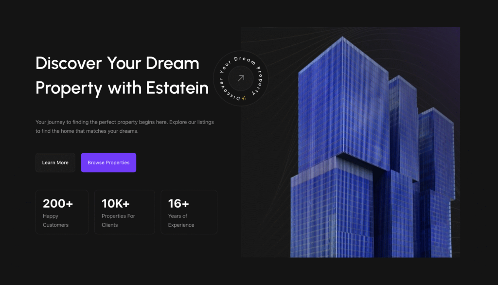

# Estatein Banner — Dark Hero with Interactive Spinner

## Description

A dark-themed split hero section with content on the left and a large image on the right. Notable for a complex interactive element: a custom "Spin Button" that uses CSS animations, 3D CSS transforms (`translateX`, `rotateZ`, `skew`), and Bricks native `_interactions` (scroll-triggered `zoomIn`). The left side also contains a grid of statistic cards.

## Visual Reference



## Element Tree

```
Section (estatein-banner-section)
└── Container (estatein-banner-container) — Flex Row (reverses on mobile)
    ├── Block (estatein-banner_col-l) — Left content block
    │   └── Block
    │       ├── Heading (h1) — "Discover Your Dream Property..."
    │       ├── Text-Basic — Description
    │       ├── Block (estatein-banner-cta-block) — Buttons Wrapper
    │       │   ├── Button (Learn More) — custom grey style
    │       │   └── Button (Browse Properties) — purple style
    │       └── Block (estatein-banner-client-insights-block) — Stats Grid
    │           ├── Div (Stats Card)
    │           │   ├── Heading — "200+"
    │           │   └── Text-Basic — "Happy Customers"
    │           ├── Div (Stats Card)
    │           │   ├── Heading — "10K+"
    │           │   └── Text-Basic — "Properties For Clients"
    │           └── Div (Stats Card)
    │               ├── Heading — "16+"
    │               └── Text-Basic — "Years of Experience"
    └── Block (estatein-baneer-image-col) — Right Image Column (bg image)
        └── Block (estatein-banner-overlay-image-block)
            └── Block (Spin button with css) — Link Wrapper (`<a>`)
                ├── Image — Circular text image
                └── Block (Arrow div)
                    └── SVG — Center arrow icon
```

## Key Discoveries & New Patterns

### 1. Complex `_interactions` Array
This is the first element utilizing the Bricks native Interactions engine. 
```json
"_interactions": [
  {
    "id": "ufdlvh",
    "trigger": "enterView",
    "action": "startAnimation",
    "animationType": "zoomIn",
    "runOnce": true
  }
]
```
- Triggers an animation (`zoomIn`) when the element scrolls into view (`enterView`).

### 2. Advanced 3D CSS Injection
The spinning button uses highly complex raw CSS injected via `_cssCustom`. This shows Bricks is totally fine with massive chunks of custom CSS logic per component.
- Uses `@keyframes` for continuous 360-degree rotation.
- Uses 3D transforms (`transform: translate3d(...) rotateZ(...) skew(...)`) for hover effects on the arrow icon.
- Uses `_zIndex: "999"` to ensure it overlaps the main visual cleanly.

### 3. Clamp() Typography
Instead of discrete breakpoints for font sizing, the main heading and buttons use modern CSS `clamp` functions for fluid typography:
`"font-size": "clamp(16px, calc(16px + (4 * ((100vw - 1440px) / 480))), 18px);"`

### 4. Background Image with Flex Content
Similar to the Single Blog Hero, the right column applies its primary image via `_background: { image: ... }`. However, it also has child content (the spin button) inside it that is positioned using Flexbox alignment (`_justifyContent: "flex-end"`).

### 5. `column-reverse` on Mobile
The main container is a flex `row`, but it uses a responsive override to switch to `column-reverse` on mobile:
`"_direction:mobile_landscape": "column-reverse"`
This is a standard pattern for split sections to ensure the image appears *above* the text on phones.

## Component Global Classes

| Class Name | Key Styles/Properties |
|---|---|
| `estatein-banner-section` | Dark bg (`#141414`), reset padding |
| `estatein-banner-container` | `flex-direction: row`, `80px` gap |
| `estatein-banner_col-l_block` | Left content wrapper, `943px` max width |
| `estatein-banner-heading` | Fluid `clamp()` size, `60px` base, Urbanist font |
| `estatein-btn_purple` | Hardcoded hex buttons, `border-radius: 8px` |
| `estatein-banner-client-insights-block` | Flex row desktop → Grid mobile |
| `estatein-baneer-image-col` | Background image container, min-height clamped |
| `cust-always-spin-div` | Custom CSS for 12s infinite rotation and 3D hover |

## Design Tokens Discovered
This element almost exclusively uses **hardcoded values** (Hex codes, `80px` gaps, absolute pixel sizes). It uses an external Google font ("Urbanist") directly referenced in typography blocks.

## JSON Code
*(Refer to original JSON structure in user input for full object hierarchy)*
