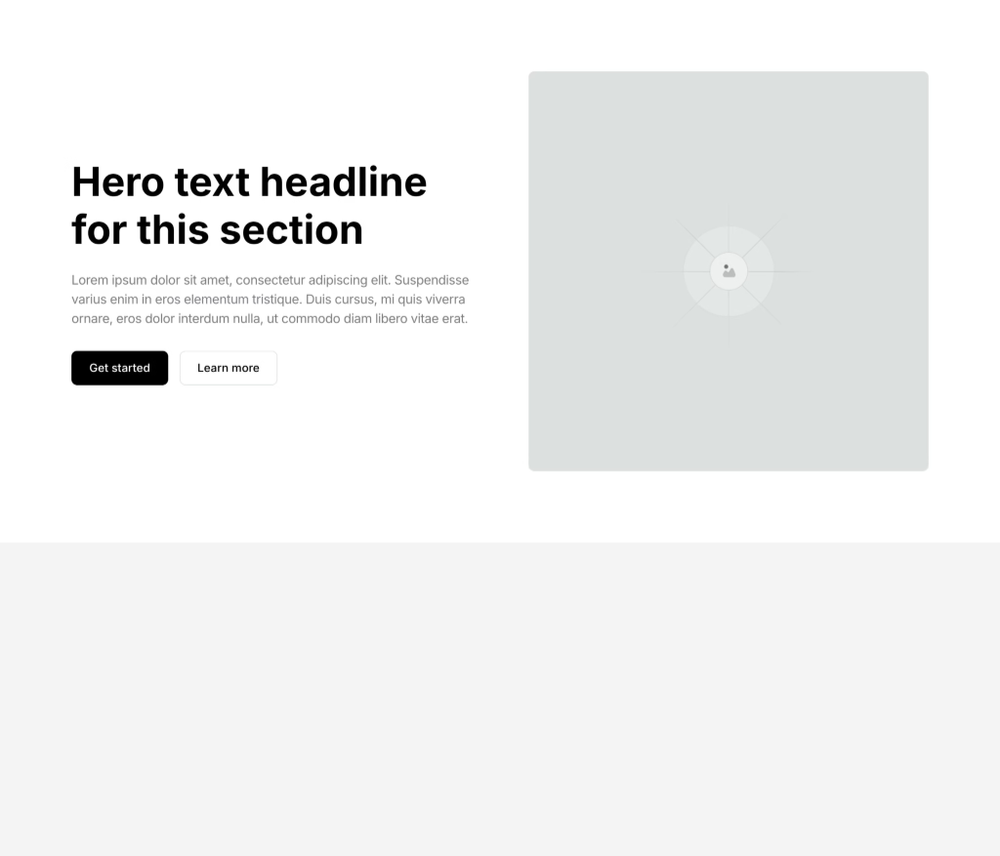

# Hero 1 — Hero Section with Image

## Description

A two-column hero section with content on the left (h1 heading, description, buttons) and a 1:1 square image on the right. Uses CSS Grid with 2-column layout, collapsing to single column on tablet. Very similar to CTA-1 but with hero-specific differences (h1 tag, 1:1 image, larger spacing).

## Visual Reference



## Element Tree

```
Section (hero-1)
└── Container (Inner) — CSS Grid 2-col
    ├── Block (Content)
    │   ├── Block (Heading Group)
    │   │   ├── Heading (h1) — "Hero text headline for this section"
    │   │   └── Text-Basic (Description) — body copy
    │   └── Block (Button Group) — flex row
    │       ├── Button (Primary) — "Get started" (style: primary)
    │       └── Button (Secondary) — "Learn more" (style: secondary)
    └── Block (Media Wrapper)
        └── Image — 1:1 aspect ratio, cover fit
```

## Key Discovery: Multi-Class Stacking

Elements reference **multiple global classes**. Some are component-specific (included in export), others are **site-wide shared classes** (NOT included in export, defined elsewhere in the Bricks theme).

### Section classes: `["hfc8yp", "ej8ua3", "8y3v1x", "shvjdm"]`
- `8y3v1x` = `hero-1` → component class (in export)
- `hfc8yp`, `ej8ua3`, `shvjdm` → **shared site-wide classes** (not in export)
- `shvjdm` also appears on CTA-1's section → **confirmed shared section class**

### Other shared classes (not in export)
| Class ID | Applied To | Likely Purpose |
|---|---|---|
| `hfc8yp` | Section | Shared section styling |
| `ej8ua3` | Section | Shared section styling |
| `shvjdm` | Section | Shared section styling (also on CTA-1) |
| `kr1r6i` | Inner Container | Shared inner styling |
| `g56yok`, `jzdzdj` | Content Block | Shared content styling |
| `uzl0vc` | Media Wrapper | Shared media wrapper styling |
| `1yrow5` | Heading | Shared heading styling |
| `8y9zzg` | Description | Shared description styling |
| `uhtqbo` | Button Group | Shared button group styling |
| `bjt4kf` | Buttons | Shared button base styling |
| `3j5lp3`, `52rigf` | Image | Shared image styling |
| `4kefc6` | Media Wrapper | Shared media wrapper styling |

## Component-Specific Global Classes

| Class Name | Key Styles |
|---|---|
| `hero-1` | Mobile padding: `var(--space-xl)` top/bottom |
| `hero-1__inner` | Grid 2-col, gap `var(--space-xl) var(--space-2xl)`, align center, tablet → 1-col, mobile gap `var(--space-l)` |
| `hero-1__content` | row-gap `var(--space-m)`, mobile `var(--space-m-mobile)` |
| `hero-1__media-wrapper` | _(empty)_ |
| `hero-1__image` | aspect-ratio `1/1`, object-fit cover, border-radius `var(--radius-s)` |
| `hero-1__heading` | _(empty)_ |
| `hero-1__description` | font-size `var(--text-l)`, color `var(--text)` |
| `hero-1__heading-group` | row-gap `var(--space-s)`, mobile `var(--space-s-mobile)` |

## Comparison: Hero-1 vs CTA-1

| Property | Hero-1 | CTA-1 |
|---|---|---|
| Heading tag | `h1` | `h2` |
| Image aspect ratio | `1/1` | `16/9` |
| Grid gap | `var(--space-xl) var(--space-2xl)` | `var(--space-l) var(--space-2xl)` |
| Grid gap mobile | `var(--space-l)` | _(not set)_ |
| Section mobile padding | `var(--space-xl)` top/bottom | _(not set)_ |
| Button approach | `style` property + shared class `bjt4kf` | Global classes `btn-primary` / `btn-secondary` |
| Shared site classes | Many (12+ IDs) | Fewer (1 ID: `shvjdm`) |
| Structure | **Identical** | **Identical** |

## Bricks Builder Code

```json
{"content":[{"id":"yneajo","name":"section","parent":0,"children":["rreven"],"settings":{"_cssGlobalClasses":["hfc8yp","ej8ua3","8y3v1x","shvjdm"]},"label":"Hero 1"},{"id":"rreven","name":"container","parent":"yneajo","children":["htykts","puowam"],"settings":{"_direction":"row","_cssGlobalClasses":["kr1r6i","yzpdv6"]},"label":"Inner"},{"id":"htykts","name":"block","parent":"rreven","children":["qhwybq","fwnxcu"],"settings":{"_cssGlobalClasses":["g56yok","jzdzdj","2jyb3n"]},"label":"Content"},{"id":"puowam","name":"block","parent":"rreven","children":["cwglsy"],"settings":{"_cssGlobalClasses":["uzl0vc","4kefc6"]},"label":"Media Wrapper"},{"id":"wocdzl","name":"heading","parent":"qhwybq","children":[],"settings":{"text":"Hero text headline for this section","_cssGlobalClasses":["1yrow5","ksd88k"],"tag":"h1"},"label":"Heading"},{"id":"ajpigh","name":"text-basic","parent":"qhwybq","children":[],"settings":{"text":"Lorem ipsum dolor sit amet, consectetur adipiscing elit. Suspendisse varius enim in eros elementum tristique. Duis cursus, mi quis viverra ornare, eros dolor interdum nulla, ut commodo diam libero vitae erat.\n\n","_cssGlobalClasses":["8y9zzg","zztcr7"]},"label":"Description"},{"id":"hgpgwj","name":"button","parent":"fwnxcu","children":[],"settings":{"text":"Get started","_cssGlobalClasses":["bjt4kf"],"link":{"type":"external","url":"#"},"style":"primary"},"label":"Button"},{"id":"mhuuiv","name":"button","parent":"fwnxcu","children":[],"settings":{"text":" Learn more","_cssGlobalClasses":["bjt4kf"],"link":{"type":"external","url":"#"},"style":"secondary"},"label":"Button"},{"id":"fwnxcu","name":"block","parent":"htykts","children":["hgpgwj","mhuuiv"],"settings":{"_cssGlobalClasses":["uhtqbo","fogixp"]},"label":"Button Group"},{"id":"cwglsy","name":"image","parent":"puowam","children":[],"settings":{"_cssGlobalClasses":["3j5lp3","52rigf","kuazn8"],"image":{"url":"https:\/\/elementor.kitstarter.io\/wp-content\/uploads\/2022\/10\/Kitstarter-Thumb_Squ.png","external":true,"filename":"Kitstarter-Thumb_Squ.png"},"tag":"figure"},"label":"Image","themeStyles":[]},{"id":"qhwybq","name":"block","parent":"htykts","children":["wocdzl","ajpigh"],"settings":{"_cssGlobalClasses":["ed3fz5"]},"label":"Heading Group"}],"source":"bricksCopiedElements","sourceUrl":"https:\/\/bricks.kitstarter.io\/json","version":"2.2-rc2","globalClasses":[{"id":"fogixp","name":"button-group","settings":{"_flexWrap":"wrap","_direction":"row","_columnGap":"var(--space-xs)","_rowGap":"var(--space-xs)","_alignItems":"center","_display":"flex","_width":"var(--w-fit)"},"category":"jutazo","modified":1755626652,"user_id":1},{"id":"8y3v1x","name":"hero-1","settings":{"_padding:mobile_landscape":{"top":"var(--space-xl)","bottom":"var(--space-xl)"}},"modified":1750149474,"user_id":1},{"id":"yzpdv6","name":"hero-1__inner","settings":{"_display":"grid","_gridTemplateColumns":"var(--grid-2)","_gridGap":"var(--space-xl) var(--space-2xl)","_alignItemsGrid":"center","_gridTemplateColumns:tablet_portrait":"var(--grid-1)","_gridGap:mobile_landscape":"var(--space-l)"},"modified":1753562743,"user_id":1},{"id":"2jyb3n","name":"hero-1__content","settings":{"_rowGap":"var(--space-m)","_rowGap:mobile_landscape":"var(--space-m-mobile)"}},{"id":"4kefc6","name":"hero-1__media-wrapper","settings":[]},{"id":"kuazn8","name":"hero-1__image","settings":{"_aspectRatio":"1\/1","_objectFit":"cover","_border":{"radius":{"top":"var(--radius-s)","right":"var(--radius-s)","bottom":"var(--radius-s)","left":"var(--radius-s)"}}}},{"id":"ksd88k","name":"hero-1__heading","settings":[]},{"id":"zztcr7","name":"hero-1__description","settings":{"_typography":{"color":{"raw":"var(--text)","id":"wmakct","name":"Color #10"},"font-size":"var(--text-l)"}}},{"id":"ed3fz5","name":"hero-1__heading-group","settings":{"_rowGap":"var(--space-s)","_rowGap:mobile_landscape":"var(--space-s-mobile)"},"modified":1765802159,"user_id":1}],"globalElements":[]}
```

## Key Patterns

1. **Multi-class stacking**: Elements stack multiple global classes — component-specific + shared site-wide
2. **Shared classes not exported**: Site-wide utility classes (like `shvjdm`) are referenced by ID but NOT included in the `globalClasses` array — they exist in the theme
3. **Identical structure to CTA-1**: Section → Container (grid) → Content (heading group + buttons) + Media. The composition pattern is a **confirmed template**.
4. **Buttons use `style` + class**: Both `"style": "primary"` AND a shared class `bjt4kf` — dual approach to button styling
5. **Hero vs CTA differentiation**: Only the heading tag (h1 vs h2), image ratio, and spacing differ — structure is shared
