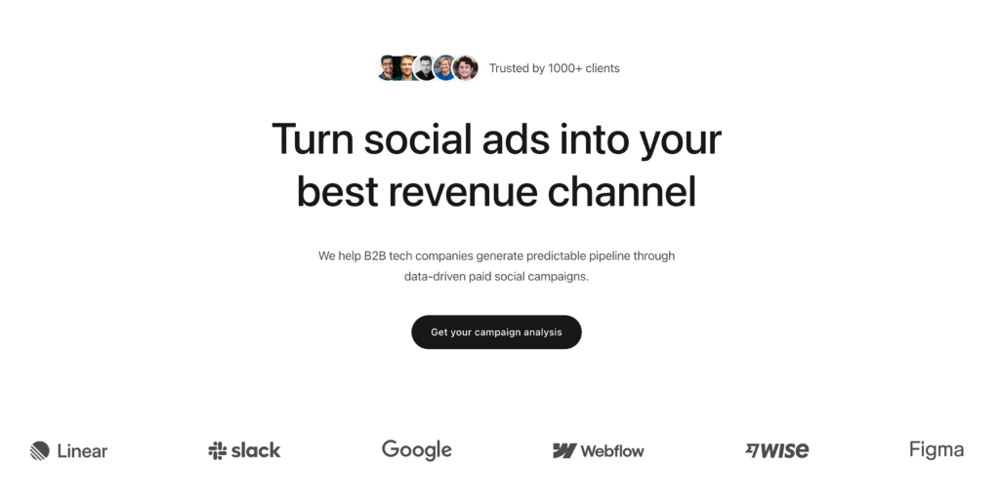

# Metric Hero — Centered Hero with Logo Cloud

## Description

A clean, minimalist hero section featuring a centered, single-column alignment. Above the main heading is a "Trusted by trust badge" row. Below the main CTA is a dedicated container serving as a multi-column logo cloud for customer logos.

## Visual Reference



## Element Tree

```
Section (metric-hero)
├── Container (metric-hero__container) — Main content (centered)
│   ├── Block (Trusted Block) — Flex row
│   │   ├── Image — Stacked profile avatars
│   │   └── Text-Basic — "Trusted by 1000+ clients"
│   ├── Heading (h1) — Main headline
│   ├── Text-Basic — Subheadline description
│   └── Button — "Get your campaign analysis"
└── Container (metric-hero__logo-container) — Logo cloud
    ├── Image — Logo 1
    ├── Image — Logo 2
    ├── Image — Logo 3
    ├── Image — Logo 4
    ├── Image — Logo 5
    └── Image — Logo 6
```

## Key Discoveries & New Patterns

### 1. Multi-Container Section Structure
Instead of putting the content and logos in one container, the section holds **two sibling containers**. 
- Container 1: High max-width (`872px`), flex column, centered align/justify.
- Container 2: Full width flex row desktop, grid on tablet/mobile.
This is a standard pattern for horizontal separations of concern within a single semantic `<section>`.

### 2. Centered Flow Layout
The main container uses native flex properties to force a perfect center-stack:
```json
"_alignSelf": "center",
"_justifyContent": "center",
"_alignItems": "center",
"_typography": {
  "text-align": "center"
}
```

### 3. Responsive Logo Grid (Flex → Grid transition)
The logo container exhibits a very complex responsive pattern. It starts as a `flex row` with `space-between` on desktop, but **switches entirely to CSS Grid** on lower breakpoints to handle stacking properly.
- **Desktop:** `_direction: "row"`, `_justifyContent: "space-between"`
- **Tablet:** `_display: "grid"`, `_gridTemplateColumns: "repeat(3, 1fr)"`
- **Mobile:** `_gridTemplateColumns: "repeat(2, 1fr)"`

This teaches us that Bricks elements can dynamically swap between flexbox and CSS Grid based on breakpoints!

### 4. Line Height Integration
This component defines a fractional `line-height` directly in the basic `_typography` object for the first time:
```json
"_typography": {
  "font-size": "72",
  "line-height": "1.2"
}
```

## Component Global Classes

| Class Name | Key Styles/Properties |
|---|---|
| `metric-default-section` | Shared section reset: 80-100px padding |
| `metric-default-container` | Shared container reset: `1728px` width |
| `metric-hero` | High `row-gap` (`150px`) pushing the logo container down |
| `metric-hero__container` | Centered text/flex, max-width `872px`, tablet max-width `100%` |
| `metric-hero__trusted-block` | Flex row, inline trust badge |
| `metric-hero__heading` | 72px base size, 1.2 line height, centered |
| `metric-hero__textarea` | Max width `634px` (creates "ragged" text wrapping distinct from heading), #4c4c4c color |
| `metric-btn_dark` | Pill radius (50), `min-height: 56px`, dark hover state |
| `metric-hero__logo-container` | Desktop space-between flex → Tablet 3-col grid → Mobile 2-col grid |
| `metric-hero__logos` | Max-width limit (`70%`) on mobile to constrain grid images |

## Design Tokens Discovered
This component primarily relies on hardcoded hex colors (`#171717`, `#4c4c4c`) and absolute structural pixels rather than css variables.

## JSON Code
*(Refer to original JSON structure in user input for full object hierarchy)*
