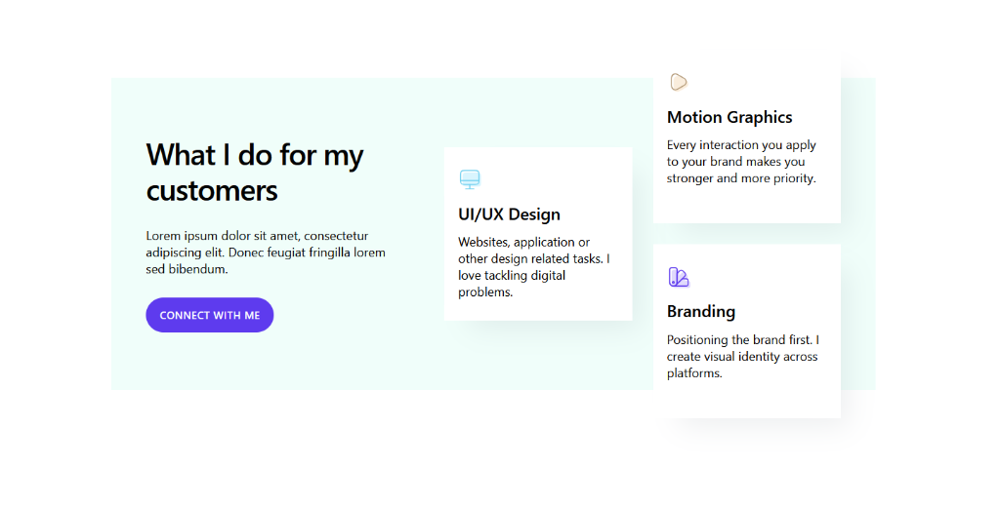

# Services Grid 1 — Feature Cards Section

## Description

A section with a 12-column CSS Grid layout. The left side (columns 1-8) contains sticky text content (H1, description, button). The right side (columns 6-12) contains a staggered grid of service cards. Each card has an icon, heading, and text, with hover shadow effects. Notable for its use of custom CSS for the staggered layout.

## Visual Reference



## Element Tree

```
Section (content-box)
└── Container (content-box__container) — CSS Grid 12-col
    ├── Block (content-box__content) — Left content (cols 1-8)
    │   ├── Heading (h1) — "What I do for my customers"
    │   ├── Text-Basic (p) — Description
    │   └── Button — "connect with me" (primary style)
    └── Block (content-box-grid-ul) — Right content (cols 6-12), tag <ul>
        ├── Block (content-box-card) — Card 1, tag <li>
        │   ├── Heading — "UI/UX Design"
        │   ├── Icon — Web design SVG icon
        │   └── Text-Basic (p) — Card description
        ├── Block (content-box-card) — Card 2, tag <li>
        │   ├── Heading — "Motion Graphics"
        │   ├── Icon — Motion graphics SVG icon
        │   └── Text-Basic (p) — Card description
        └── Block (content-box-card) — Card 3, tag <li>
            ├── Heading — "Branding"
            ├── Icon — Branding SVG icon
            └── Text-Basic (p) — Card description
```

## Key Discoveries & New Patterns

### 1. 12-Column Grid System
Unlike previous 1-col or 2-col grids, this uses a robust 12-column grid to overlap content:
- Parent: `_gridTemplateColumns: "repeat(12, 1fr);"`
- Left Content: `_gridItemColumnSpan: "1 / 9"` (spans cols 1 to 8)
- Right Grid: `_gridItemColumnSpan: "6 / -1"` (spans col 6 to end, overlapping the left side)

### 2. Semantic HTML Tags via `tag` Property
- The cards wrapper block is set to `"tag": "ul"`
- Individual cards are set to `"tag": "li"`
- Headings use `"tag": "h1"` and `"tag": "p"`

### 3. Custom CSS Injection (Massive Pattern!)
This is the first element using native Bricks Custom CSS `_cssCustom`.
- **List Styling Reset** (on the `ul` wrapper):
  ```css
  .content-box-grid-ul {
    list-style: none;
    padding-left: 0;
    list-style-type: none;
    margin-left: 0em;
    margin-right: 0;
  }
  ```
- **Staggered Card Layout** (on the card class):
  ```css
  @media (min-width:767px) {
    .content-box-card:nth-child(1) { grid-row: 2 / 4; }
    .content-box-card:nth-child(2), .content-box-card:nth-child(3) {
      grid-column: 2 / 3;
      grid-row: span 2;
    }
  }
  .content-box-card {
    box-shadow: 24px 24px 40px -12px rgba(28, 44, 64, .08);
  }
  ```

### 4. SVG Icon Element
A new way to handle icons using the WP media library SVG integration:
```json
{
  "icon": {
    "library": "svg",
    "svg": {
      "id": 215,
      "filename": "ux-design-icon.svg",
      "url": "https://board.local/wp-content/uploads/2025/04/ux-design-icon.svg"
    }
  }
}
```

## Component Global Classes

| Class Name | Key Styles/Properties |
|---|---|
| `content-box` | overflow: hidden, tablet bg color override |
| `content-box__container` | display: grid, grid-template-columns: repeat(12,1fr), heavy padding (`5rem` all sides), bg color `#f0fefa`, height `45rem` |
| `content-box__content` | grid span `1/9`, heavy padding, position relative, tablet reset to span `1` |
| `content-box__heading` | font-weight 600, letter-spacing `-.025em` |
| `content-box__text` | _(empty)_ |
| `content-box-grid-ul` | display grid, 2 cols, 4 rows, span `6/-1`, gap `3rem` |
| `content-box-card` | bg white, padding `2-3rem`, row-gap `1.5rem` |
| `content-box-card__heading` | font-weight 600 |
| `content-box-card__icon` | _order: `-1` (moves it above heading visually) |
| `content-box-card__text` | _(empty)_ |
| `content-box__button` | heavy padding, uppercase, weight 600, primary purple bg (`#5e3bee`), large pill radius (`50`) |

## Design Tokens Discovered

- **Layout**: `--grid-gap` (new)
- **Colors**: `--neutral-ultra-light` (new)
- **Note**: This element mixes tokens and hardcoded HEX/rem values (e.g., `#5e3bee`, `5rem`, `#f0fefa`).

## JSON Code

*(Refer to original JSON structure in user input for full object hierarchy)*
