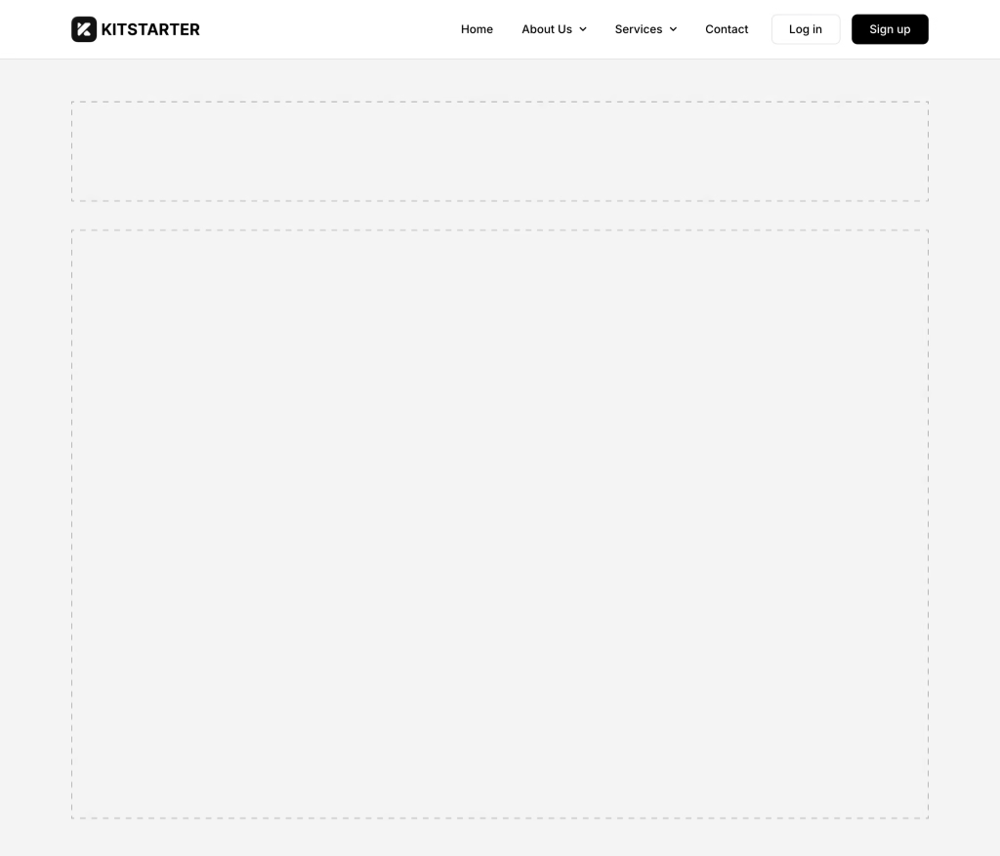

# Navbar 1 — Top Navigation Bar

## Description

A responsive top navigation bar with logo on the left and navigation items on the right. Includes text links, a dropdown menu with sub-links, and CTA buttons (Log in / Sign up). Collapses to a hamburger toggle menu on tablet breakpoint with full-width mobile menu.

## Visual Reference



## Element Tree

```
Section (navbar-1)
└── Container (Inner) — flex row, space-between
    ├── Logo — site logo with max-width constraint
    └── Nav Nested — responsive nav wrapper
        ├── Block (Nav Items) — <ul> tag
        │   ├── Text-Link — "Home"
        │   ├── Text-Link — "About Us"
        │   ├── Dropdown — "Services"
        │   │   └── Div (Dropdown Content) — <ul> tag
        │   │       ├── Text-Link — "Dropdown link 1"
        │   │       ├── Text-Link — "Dropdown link 2"
        │   │       └── Text-Link — "Dropdown link 3"
        │   ├── Text-Link — "Contact"
        │   └── Div (Menu Buttons) — flex row
        │       ├── Button — "Log in" (secondary style)
        │       └── Button — "Sign up" (primary style)
        └── Toggle — hamburger icon (squeeze animation)
```

## New Element Types Discovered

| Element Type | Purpose |
|---|---|
| `logo` | Site logo with `logoText` and `logo` image |
| `nav-nested` | Responsive navigation wrapper with mobile menu support |
| `text-link` | Text with link — used for nav items |
| `dropdown` | Dropdown trigger with chevron icon |
| `div` | Generic div (used for dropdown content and button wrappers) |
| `toggle` | Hamburger menu toggle for mobile |

## New Settings Properties Discovered

| Property | Element | Description |
|---|---|---|
| `logoText` | logo | Fallback text for the logo |
| `logo` | logo | Logo image object |
| `mobileMenu` | nav-nested | Breakpoint to trigger mobile menu (`"tablet_portrait"`) |
| `style` | button | Built-in button style variant (`"primary"`, `"secondary"`) |
| `animation` | toggle | Hamburger animation type (`"squeeze"`) |
| `tag` | block/div | Override HTML tag (e.g., `"ul"`) |
| `_hidden._cssClasses` | block/div | Internal Bricks CSS classes (`"brx-nav-nested-items"`, `"brx-dropdown-content"`) |
| `cloneable` | block/div | Whether element can be cloned (`false`) |
| `deletable` | block/div | Whether element can be deleted (`false`) |
| `themeStyles` | various | Theme style references (empty array `[]`) |

## Nav-Nested Specific Settings (on `navbar-1__nav` class)

This is a complex element with many built-in settings:

| Setting | Value | Description |
|---|---|---|
| `gap` | `var(--space-m)` | Gap between nav items |
| `itemTypography` | font-size, weight, line-height | Typography for nav items |
| `itemPadding` | top/bottom padding | Padding on nav items |
| `itemTransition:tablet_portrait` | `0.3s` | Mobile transition speed |
| `iconSize` | `var(--text-m)` | Dropdown chevron icon size |
| `iconGap` | `var(--space-xxs)` | Gap between text and icon |
| `dropdownBackgroundColor` | `var(--bg-color)` | Dropdown bg color |
| `dropdownBorder` | solid, var widths, radius | Dropdown border |
| `dropdownPadding` | top/bottom/left/right | Dropdown internal padding |
| `dropdownItemTypography` | line-height, weight, nowrap | Dropdown item text styles |
| `dropdownItemBackground:hover` | `var(--color-light)` | Dropdown item hover bg |
| `dropdownContentWidth` | `var(--w-fit)` | Dropdown width |
| `dropdownTransform` | translateY: 40 | Dropdown initial transform |
| `dropdownTransformOpen` | translateY: 0 | Dropdown open transform |
| `mobileMenuAlignItems:tablet_portrait` | `stretch` | Mobile menu alignment |
| `mobileMenuHeight:tablet_portrait` | `var(--w-fit)` | Mobile menu height |
| `mobileMenuBackgroundColor:tablet_portrait` | `var(--bg-color)` | Mobile menu bg |
| `mobileMenuWidth:tablet_portrait` | `100%` | Mobile menu width |
| `mobileMenuPosition:tablet_portrait` | `{ top: "100%" }` | Mobile menu position |

## Global Classes Used

| Class Name | Key Styles |
|---|---|
| `navbar-1` | padding with `var(--space-s-mobile)` / `var(--gutter)`, position relative, mobile padding `var(--space-xs)` |
| `navbar-1__inner` | flex row, nowrap, space-between, align center, gap `var(--space-m)`, max-width `var(--container-max-width)` |
| `navbar-1__logo` | max-width `11.25rem` |
| `navbar-1__nav` | Complex nav settings (see table above) |
| `navbar-1__nav-items` | tablet: padding with gutters, absolute positioning, spacing `var(--space-xl)` bottom |
| `navbar-1__nav-link` | _(empty)_ |
| `navbar-1__nav-dropdown` | _(empty)_ |
| `navbar-1__nav-dropdown-content` | overflow hidden |
| `navbar-1__toggle` | bar scale 0.7, bar height 2.5, width 32 |
| `navbar-1__menu-buttons` | flex row, gap `var(--space-xs)`, tablet: column direction, stretch, full width, margin-top |

## Additional Design Tokens Discovered

**Spacing**: `--space-xxs`, `--space-xs-mobile`, `--space-xl`, `--space-none`, `--gutter`
**Colors**: `--bg-color`, `--color-light`, `--transparent-bg`
**Border**: `--radius-none`
**Layout**: `--w-fit`

## Bricks Builder Code

```json
{"content":[{"id":"geidve","name":"section","parent":0,"children":["chpmci"],"settings":{"_cssGlobalClasses":["lzg6q8"]},"label":"Navbar 1"},{"id":"chpmci","name":"container","parent":"geidve","children":["xzzumo","jerkdv"],"settings":{"_cssGlobalClasses":["4hn8mg"]},"label":"Inner"},{"id":"xzzumo","name":"logo","parent":"chpmci","children":[],"settings":{"logoText":"bricks.kitstarter.io","logo":{"url":"https:\/\/elementor.kitstarter.io\/wp-content\/uploads\/2022\/10\/kitstarter-logo.png","external":true,"filename":"kitstarter-logo.png"},"_cssGlobalClasses":["s2b6ew"]},"label":"Logo","themeStyles":[]},{"id":"jerkdv","name":"nav-nested","parent":"chpmci","children":["gowofq","foxbht"],"settings":{"_cssGlobalClasses":["1pykgc"],"mobileMenu":"tablet_portrait"},"label":"Nav","themeStyles":[]},{"id":"gowofq","name":"block","parent":"jerkdv","children":["bjiqcf","zumsqk","zzxdsv","dsaiiy","ptdtef"],"settings":{"tag":"ul","_hidden":{"_cssClasses":"brx-nav-nested-items"},"_cssGlobalClasses":["bwou5e"]},"label":"Nav Items","cloneable":false,"deletable":false},{"id":"bjiqcf","name":"text-link","parent":"gowofq","children":[],"settings":{"text":"Home","link":{"type":"external","url":"#"},"_cssGlobalClasses":["rozs5r"]},"label":"Nav Link","themeStyles":[]},{"id":"zumsqk","name":"text-link","parent":"gowofq","children":[],"settings":{"text":"About Us","link":{"type":"external","url":"#"},"_cssGlobalClasses":["rozs5r"]},"label":"Nav Link","themeStyles":[]},{"id":"zzxdsv","name":"dropdown","parent":"gowofq","children":["avqpsg"],"settings":{"text":"Services","_cssGlobalClasses":["32fcgb"]},"label":"Nav Dropdown","themeStyles":[]},{"id":"avqpsg","name":"div","parent":"zzxdsv","children":["qqbmat","abpyqw","woczrj"],"settings":{"_hidden":{"_cssClasses":"brx-dropdown-content"},"tag":"ul","_cssGlobalClasses":["7616tl"]},"label":"Nav Dropdown Content","cloneable":false,"deletable":false},{"id":"qqbmat","name":"text-link","parent":"avqpsg","children":[],"settings":{"text":"Dropdown link 1","link":{"type":"external","url":"#"},"_cssGlobalClasses":["rozs5r"]},"label":"Nav Link","themeStyles":[]},{"id":"abpyqw","name":"text-link","parent":"avqpsg","children":[],"settings":{"text":"Dropdown link 2","link":{"type":"external","url":"#"},"_cssGlobalClasses":["rozs5r"]},"label":"Nav Link","themeStyles":[]},{"id":"woczrj","name":"text-link","parent":"avqpsg","children":[],"settings":{"text":"Dropdown link 3","link":{"type":"external","url":"#"},"_cssGlobalClasses":["rozs5r"]},"label":"Nav Link","themeStyles":[]},{"id":"dsaiiy","name":"text-link","parent":"gowofq","children":[],"settings":{"text":"Contact","link":{"type":"external","url":"#"},"_cssGlobalClasses":["rozs5r"]},"label":"Nav Link","themeStyles":[]},{"id":"ptdtef","name":"div","parent":"gowofq","children":["jzqoco","qlxqyp"],"settings":{"_cssGlobalClasses":["rx4z9j"]},"label":"Menu Button"},{"id":"qlxqyp","name":"button","parent":"ptdtef","children":[],"settings":{"text":"Sign up","_cssGlobalClasses":[],"style":"primary"}},{"id":"jzqoco","name":"button","parent":"ptdtef","children":[],"settings":{"text":"Log in","style":"secondary","_cssGlobalClasses":[]}},{"id":"foxbht","name":"toggle","parent":"jerkdv","children":[],"settings":{"_cssGlobalClasses":["c3u42o"],"animation":"squeeze"},"label":"Toggle","themeStyles":[]}],"source":"bricksCopiedElements","sourceUrl":"https:\/\/bricks.kitstarter.io\/json","version":"2.2-rc2","globalClasses":[{"id":"lzg6q8","name":"navbar-1","settings":{"_padding":{"top":"var(--space-s-mobile)","bottom":"var(--space-s-mobile)","left":"var(--gutter)","right":"var(--gutter)"},"_position":"relative","_padding:mobile_landscape":{"bottom":"var(--space-xs)","top":"var(--space-xs)"}},"modified":1755701311,"user_id":1},{"id":"4hn8mg","name":"navbar-1__inner","settings":{"_width":"var(--container-width)","_widthMax":"var(--container-max-width)","_direction":"row","_columnGap":"var(--space-m)","_alignItems":"center","_flexWrap":"nowrap","_justifyContent":"space-between"}},{"id":"s2b6ew","name":"navbar-1__logo","settings":{"_widthMax":"11.25rem"}},{"id":"1pykgc","name":"navbar-1__nav","settings":{"gap":"var(--space-m)","itemTypography":{"font-size":"var(--text-m)","font-weight":"500","line-height":"var(--leading-loose)"},"iconSize":"var(--text-m)","dropdownBackgroundColor":{"raw":"var(--bg-color)","id":"syjtwa","name":"Color #6"},"dropdownBorder":{"style":"solid","width":{"top":"var(--border-width)","right":"var(--border-width)","bottom":"var(--border-width)","left":"var(--border-width)"},"color":{"raw":"var(--border-color)","id":"neojqn","name":"Color #5"},"radius":{"top":"var(--radius-s)","right":"var(--radius-s)","bottom":"var(--radius-s)","left":"var(--radius-s)"}},"iconGap":"var(--space-xxs)","dropdownItemTypography":{"line-height":"var(--leading-loose)","font-weight":"500","white-space":"nowrap"},"dropdownPadding":{"top":"var(--space-xs-mobile)","bottom":"var(--space-xs-mobile)","left":"var(--space-xs)","right":"var(--space-xs)"},"dropdownItemBackground:hover":{"raw":"var(--color-light)","id":"skfccs","name":"Color #3"},"dropdownContentWidth":"var(--w-fit)","mobileMenuAlignItems:tablet_portrait":"stretch","mobileMenuHeight:tablet_portrait":"var(--w-fit)","mobileMenuBackgroundColor:tablet_portrait":{"raw":"var(--bg-color)","id":"syjtwa","name":"Color #6"},"dropdownBorder:tablet_portrait":{"style":"none","radius":{"top":"var(--radius-none)","right":"var(--radius-none)","bottom":"var(--radius-none)","left":"var(--radius-none)"}},"dropdownBackgroundColor:tablet_portrait":{"raw":"var(--transparent-bg)"},"_zIndex":"1","mobileMenuWidth:tablet_portrait":"100%","mobileMenuPosition:tablet_portrait":{"top":"100%"},"itemPadding:tablet_portrait":{"bottom":"var(--space-xs-mobile)","top":"var(--space-xs-mobile)"},"dropdownPadding:tablet_portrait":{"left":"var(--gutter)"},"gap:tablet_portrait":"var(--space-none)","itemTransition:tablet_portrait":"0.3s","itemPadding":{"top":"var(--space-xs-mobile)","bottom":"var(--space-xs-mobile)"},"dropdownTransform":{"translateY":"40"},"dropdownTransformOpen":{"translateY":"0"}},"modified":1755701311,"user_id":1},{"id":"bwou5e","name":"navbar-1__nav-items","settings":{"_padding:tablet_portrait":{"left":"var(--gutter)","right":"var(--gutter)","bottom":"var(--space-xl)","top":"var(--space-s)"},"_position:tablet_portrait":"absolute"}},{"id":"rozs5r","name":"navbar-1__nav-link","settings":[]},{"id":"32fcgb","name":"navbar-1__nav-dropdown","settings":[]},{"id":"7616tl","name":"navbar-1__nav-dropdown-content","settings":{"_overflow":"hidden"}},{"id":"c3u42o","name":"navbar-1__toggle","settings":{"barScale":".7","barHeight":"2.5","_width":"32"},"modified":1755701311,"user_id":1},{"id":"rx4z9j","name":"navbar-1__menu-buttons","settings":{"_display":"flex","_rowGap":"var(--space-xs)","_columnGap":"var(--space-xs)","_direction:tablet_portrait":"column","_width:tablet_portrait":"100%","_display:tablet_portrait":"flex","_alignItems:tablet_portrait":"stretch","_margin:tablet_portrait":{"top":"var(--space-s)"}}}],"globalElements":[]}
```

## Key Patterns

1. **Nav-specific element types**: `logo`, `nav-nested`, `text-link`, `dropdown`, `toggle` are Bricks-native nav elements
2. **Built-in nav settings**: `nav-nested` has its own settings API for dropdown styling, mobile menu, transitions, etc. — not just CSS
3. **Button `style` property**: Buttons can use `"primary"` / `"secondary"` built-in styles instead of global classes
4. **`_hidden._cssClasses`**: Internal Bricks CSS classes for structural elements (e.g., `brx-nav-nested-items`)
5. **`themeStyles`**: Present on many nav elements (empty array), likely for theme-level overrides
6. **`cloneable` / `deletable`**: Structural elements can be locked from user modification
7. **Mobile menu pattern**: Uses absolute positioning, dropdown at `top: 100%`, full-width, with guttered padding
8. **Dropdown animation**: `dropdownTransform` (translateY: 40) → `dropdownTransformOpen` (translateY: 0)
